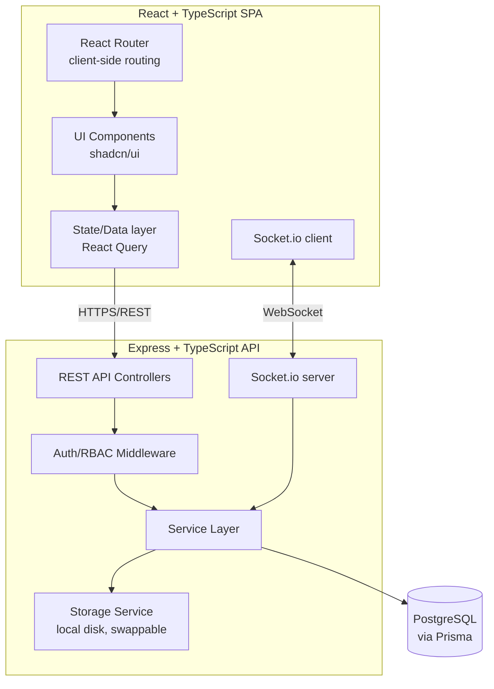
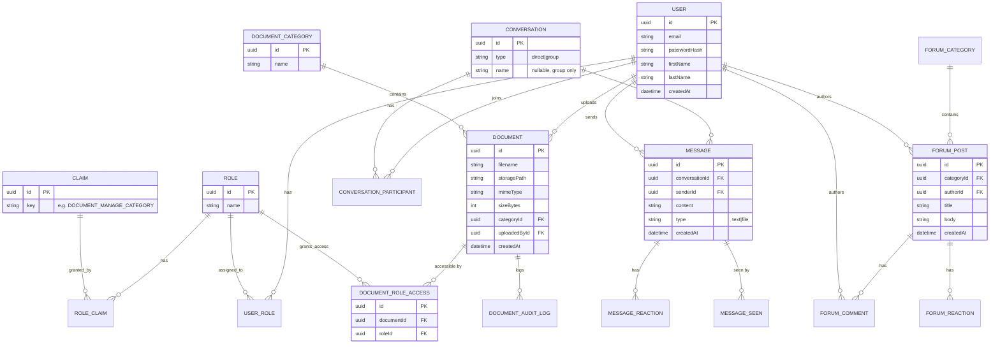

# System Design — Meridian

**Document 3 of the SDLC series — Design Phase**
**Increment:** 1 (MVP)

---

## 1. High-Level Architecture

Monorepo with two deployable apps (`client`, `server`) sharing a `packages/shared` folder for common TypeScript types (DTOs, enums) — avoids type drift between frontend and backend without adding microservice complexity.



**Key architectural decisions:**

- **Layered backend**: Controller → Service → Prisma (repository-ish) layers, so business logic isn't stuck inside route handlers (testable, and reads well in a code review).
- **Shared types package**: `packages/shared/types.ts` exported from a workspace package, imported by both client and server — one source of truth for e.g. `PermissionClaim`, `DocumentDTO`.
- **Storage abstraction**: `StorageService` interface with a `LocalDiskStorageService` implementation for MVP; a `S3StorageService` can be added later without touching controllers/services.
- **Socket.io alongside REST**, not replacing it: REST for CRUD, Socket.io only for chat's real-time push (messages, typing indicators, presence) and optionally live dashboard updates later.

## 2. Repository Structure

```
meridian/
├── apps/
│   ├── client/            # React + TS (Vite)
│   └── server/            # Express + TS
├── packages/
│   └── shared/            # Shared types, constants, validation schemas (zod)
├── docker-compose.yml      # Postgres (+ later: app containers)
├── docs/                   # This SDLC document series
└── package.json            # npm workspaces root
```

## 3. Database Schema (ERD)



_(Simplified — junction/audit tables like `DOCUMENT_AUDIT_LOG`, `MESSAGE_REACTION`, `MESSAGE_SEEN`, `FORUM_REACTION` (single "Like" type) shown as relationships only; full column lists will live in the Prisma schema itself during implementation.)_

## 4. API Design (REST)

Base path: `/api/v1`

| Resource            | Method              | Path                          | Auth/Claim                                                                                        |
| ------------------- | ------------------- | ----------------------------- | ------------------------------------------------------------------------------------------------- |
| Auth                | POST                | `/auth/login`                 | Public                                                                                            |
| Auth                | POST                | `/auth/refresh`               | Refresh token                                                                                     |
| Auth                | POST                | `/auth/logout`                | Authenticated; revokes the refresh token and clears its cookie                                    |
| Users               | GET/POST/PUT/DELETE | `/users`                      | `USER_MANAGE`                                                                                     |
| Roles               | GET/POST/PUT/DELETE | `/roles`                      | `ROLE_MANAGE`                                                                                     |
| Claims              | GET                 | `/claims`                     | `ROLE_MANAGE`                                                                                     |
| Documents           | GET                 | `/documents?categoryId=`      | authenticated; results filtered to documents whose role-access list intersects the caller's roles |
| Documents           | POST                | `/documents` (multipart)      | `DOCUMENT_CREATE`                                                                                 |
| Documents           | GET/PUT/DELETE      | `/documents/:id`              | claim + document role-access check                                                                |
| Documents           | PUT                 | `/documents/:id/roles`        | owner or `DOCUMENT_MANAGE` (sets the document's accessible role list)                             |
| Document Categories | GET/POST/PUT/DELETE | `/document-categories`        | `DOCUMENT_CATEGORY_MANAGE`                                                                        |
| Conversations       | GET/POST            | `/conversations`              | authenticated                                                                                     |
| Messages            | GET/POST            | `/conversations/:id/messages` | participant                                                                                       |
| Forums              | GET/POST/PUT/DELETE | `/forums`                     | authenticated + claims                                                                            |
| Forum Categories    | GET/POST/PUT/DELETE | `/forum-categories`           | `FORUM_CATEGORY_MANAGE`                                                                           |
| Forum Comments      | GET/POST/DELETE     | `/forums/:id/comments`        | authenticated                                                                                     |
| Dashboard           | GET                 | `/dashboard/summary`          | authenticated (claim-filtered response)                                                           |

**WebSocket events (Socket.io namespace `/chat`):**
`message:send`, `message:new` (broadcast), `typing:start/stop`, `presence:update`, `message:seen`

Full request/response schemas will be authored as an OpenAPI spec during implementation (NFR-9), not hand-written here, to avoid drift between doc and code.

## 5. UI / Wireframe Approach

Rather than hand-drawn wireframes, Increment 1 will scaffold screens directly from shadcn/ui + Efferd/shadcnblocks block collections (Auth, Dashboard, App Shell blocks map directly onto Login/Register, Dashboard, and the main authenticated layout), then customize theme tokens (colors, radius, typography) so it doesn't read as an unmodified template. Core screens for MVP:

- Login
- App Shell (sidebar nav + topbar, role-aware menu items)
- Dashboard (widgets: documents, forums, chat unread)
- Document Category browser + Document detail/preview + Upload modal
- Chat (conversation list + message thread)
- Forum category list + Post detail + Comments
- Admin: Users, Roles & Claims management screens

## 6. Non-Functional Design Notes

- **Auth**: short-lived access JWT (~15 min, carries only `userId`/`roleId(s)`, no claims) + longer-lived refresh token (httpOnly cookie), refresh rotation on use.
- **Authorization**: permission claims resolved per-request via a role→claims cache (in-memory for MVP, Redis-ready), invalidated on role edits so permission changes apply immediately without waiting for token refresh.
- **File uploads**: `multer` (disk storage) on the server, validated by mimetype allowlist + max size; served back via an authenticated streaming endpoint (not static file serving) so permission checks apply on every download.
- **Validation**: `zod` schemas shared between client (form validation) and server (request validation) via the shared package.
- **Testing**: Vitest/Jest + Supertest for backend integration tests; React Testing Library for frontend component tests.

## 8. Development Environment & Workflow

| Aspect                | Choice                                                         |
| --------------------- | -------------------------------------------------------------- |
| OS                    | Ubuntu (local dev)                                             |
| IDE                   | VS Code                                                        |
| Version control       | Git, hosted on GitHub                                          |
| AI coding assistant   | OpenCode                                                       |
| Automated code review | CodeRabbit — reviews every Pull Request on GitHub before merge |

**Workflow:** feature branches → PR opened on GitHub → CodeRabbit automated review + Oxlint/Prettier/TypeScript checks run in CI → self-review/merge to `main`. Even solo, this PR-based flow is kept deliberately (rather than pushing straight to `main`) so the repo history itself demonstrates a real review discipline — every feature/task from the Phase 4 backlog becomes its own branch + PR, closing the corresponding GitHub Issue.

## 9. Next Step

Proceed to **Phase 3: Project Management Setup** — backlog creation (epics → user stories → tasks), milestone breakdown for the incremental delivery plan, and repo/tooling bootstrap — before implementation begins.

---

_End of Document 3 — System Design_
